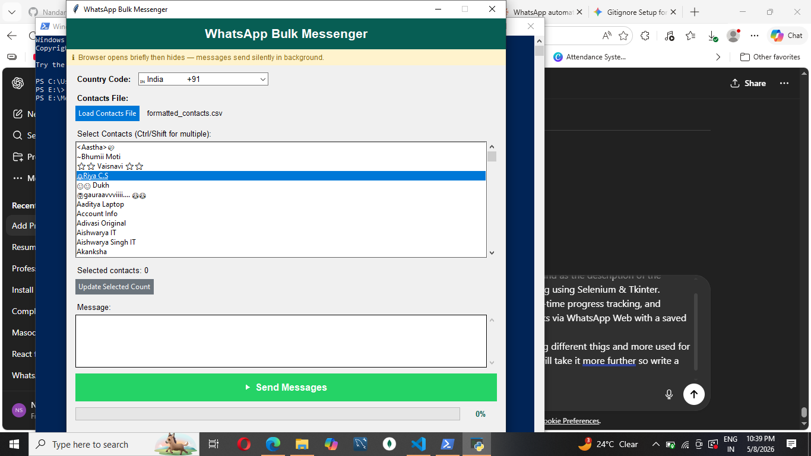

# Python Selenium WhatsApp Bot

A desktop-based WhatsApp automation tool built using Python, Selenium, and Tkinter.

This project allows users to send WhatsApp messages to multiple contacts through WhatsApp Web using a simple GUI interface. It supports CSV-based contact management, saved login sessions, progress tracking, desktop notifications, and country code handling.

> This project was created for learning automation, GUI development, Selenium workflows, and browser-based interaction using Python.

---

# Features

- Bulk WhatsApp message sending
- GUI built with Tkinter
- WhatsApp Web automation using Selenium
- CSV-based contact loading
- Multi-contact selection
- Country code support
- Real-time progress tracking
- Desktop notifications
- Saved WhatsApp login session
- Background browser handling
- Error handling and logging

---

# Tech Stack

- Python
- Selenium
- Tkinter
- Chromium Browser
- ChromeDriver
- Plyer Notifications

---

# Project Structure

```bash
Python-Selenium-WhatsApp-Bot/
│
├── screenshots/
│   ├── before_sending.png
│   └── after_sending.png
│
├── login_once.py
├── whatsapp_messenger.py
├── formatted_contacts.csv
├── requirements.txt
├── README.md
├── .gitignore
```

---

# Screenshots

## Before Sending Messages



---

## After Sending Messages


---

# Installation

## 1. Clone Repository

```bash
git clone https://github.com/YOUR_USERNAME/Python-Selenium-WhatsApp-Bot.git
```

---

## 2. Install Dependencies

```bash
pip install -r requirements.txt
```

---

# Setup Instructions

## Step 1 — Download ChromeDriver

Download the ChromeDriver version matching your Chromium/Chrome browser:

https://googlechromelabs.github.io/chrome-for-testing/

Place:

```bash
chromedriver.exe
```

inside the project folder.

---

## Step 2 — Configure Chromium Path

Update the Chromium browser path inside:

```python
login_once.py
whatsapp_messenger.py
```

Example:

```python
CHROMIUM_PATH = r"C:\Users\YourName\AppData\Local\Chromium\Application\chrome.exe"
```

---

## Step 3 — Run One-Time Login

```bash
python login_once.py
```

- Scan the WhatsApp QR code
- Wait until chats fully load
- Press ENTER in terminal

This saves your WhatsApp session locally.

---

## Step 4 — Run Main Application

```bash
python whatsapp_messenger.py
```

---

# CSV Contact Format

Example CSV format:

```csv
name,phone
John,+911234567890
Alice,+919876543210
```

---

# Future Improvements

- React-based frontend
- Better UI/UX
- Message scheduling
- Image/document sending
- Contact search and filtering
- Better browser auto-detection
- Executable desktop application
- Authentication system
- Cloud-based messaging dashboard

---

# Limitations

- Requires WhatsApp Web
- Requires ChromeDriver
- Browser paths are currently manually configured
- Dependent on WhatsApp Web layout changes

---

# Disclaimer

This project is intended for educational and learning purposes only.

Users are responsible for complying with WhatsApp's Terms of Service and applicable usage policies.

---

# Author

Developed by Nandani Sharma